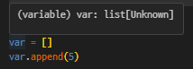
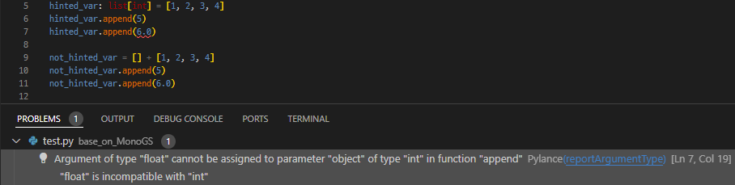

# Type hints (자료형 힌트) 정리

Python의 정적 분석 및 코드 분석 효율화를 위한 Typing 관련 정리 및 예시 문서

## Type hints 란?

Pyhton의 경우 `Duck Typing`이라는 개념으로 각 객체의 유형보다는 그 안에 있는 속성과 method로 결정됨.<br/>
이러한 요소는 빠른 생산성을 가져오지만, 반대로 해당 객체의 속성과 method를 정확히 모를 경우, 코드 읽기가 어려울 수 있다.<br/>
해당 문제점을 보완하기 위하여, 각 인자의 자료형을 표시할 수 있는 방법으로 `type hints`가 존재 함.

`단, 해당 사항은 python애서 이를 필수적으로 사용해야 함을 의미하는 것은 아니며, 단지 보조적인 요소로 제시 됨.`

## Type hints 장점

- 통합개발환경(IDE)에서 해당 type hint를 바탕으로 정적 코드 분석을 진행.


- 각 개체에 존재하는 속성관 method에 자동완성 기능을 사용 가능

## Type hints 사용 방법

### 암시적인 Type hints



연구실에서 코드 작성과 분석 과정에서 사용되는 통합개발환경(IDE, ex. visual studio code)에서는 해당 기능을 자동으로 활성화 되어 있음.<br/>
위의 사진에서 별도의 작업을 하지 않았음에도, 변수 `var`가 `list`임을 보이고 있음.<br/> 
그 결과 변수 `var` 안에 존재하는 method `append`를 강조 표시를 해주고 있음을 확인 할 수 있음. <br/>


### 명시적인 Type hints




```python
class Person():
    def __init__(self, naem, age):
        self.name = name
        self.age = age

```