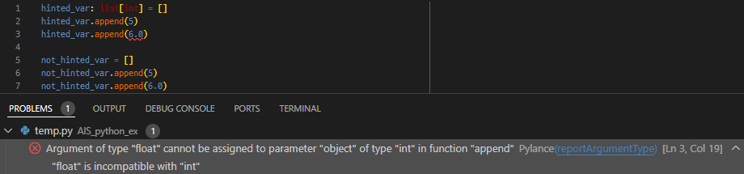

# Type hints (자료형 힌트) 기초 정리

Python의 정적 분석 및 효율적인 코딩 작업 위한 Typing 관련 정리 및 예시 문서

## Type hints 란?

Pyhton의 경우 `Duck Typing`이라는 개념으로 각 객체의 유형보다는 그 안에 있는 속성과 method로 결정됨.  
이러한 요소는 빠른 생산성을 가져오지만, 반대로 해당 객체의 속성과 method를 정확히 모를 경우, 코드 읽기가 어려울 수 있다.  
해당 문제점을 보완하기 위하여, 각 인자의 자료형을 표시할 수 있는 방법으로 `type hints`가 존재 함.  

`단, 해당 사항은 python애서 이를 필수적으로 사용해야 함을 의미하는 것은 아니며, 단지 보조적인 요소로 제시 됨.`

## Type hints 장점

- 통합개발환경(IDE)에서 해당 type hint를 바탕으로 정적 코드 분석을 진행할 수 있음

- 각 개체에 존재하는 속성과 method에 대하여 자동완성 기능을 사용 가능

## Type hints 사용에 따른 변화

### 암시적인 변수 type hints의 경우


기본적으로 통합개발환경(IDE, ex. visual studio)에서는 해당 기능을 자동으로 활성화 되어 있음.  
위의 사진에서 추가적인 요소가 없음에도`암시적 사용`을 통해, 변수 `var`가 `list`임을 보이고 있음.  
그 결과 변수 `var` 안에 존재하는 method `append`를 색상 강조 표시를 해주고 있음을 확인 할 수 있음.  

### 명시적인 변수 type hints의 경우

암시적으로 사용된 `type hints`은 명시적인 사용한 경우와 비교하여 그 기능에 제한적인 요소가 많이 존재 함.  
위의 사진은 `list` 변수에 대하여 type hint의 `명시적 사용`에 따른 차이 비교로, 사용하지 않은 경우와 비교를 나타내고 있음.  



그림에서 2개의 변수 `hinted_var`과 `not_hinted_var`은 동일한 방법으로 list 변수를 선언하여 할당 됨.  

변수 `hinted_var`의 경우 int 자료형으로 구성된 list 변수임을 명시하였음.  
그 결과 해당 변수에 float 자료형 6.0을 추가하는 경우, 잘못된 변수를 사용하였다는 에러가 출력 됨.  

반면 변수 `not_hinted_var`의 경우 별도의 type hint를 작성하지 않음.  
그 결과 해당 변수에 float 자료형 6.0을 추가하는 경우에도 별다른 에러 메세지를 출력하지 않음.  
이는 list에 존재하는 데이터가 int만이 아닌 float의 가능성이 존재하며, 이후 문제가 발생 할 수 있음.  

변수 `hinted_var`와 같이 명시적으로 선언하는 것으로 해당 문제를 조기에 발견하고 대응하는 것이 가능함.  
이러한 실수를 줄이기 위하여, 명시적인 type hint를 사용하는 것을 권장함.  

## 기초 사용법

```python
class Person():
    def __init__(self, naem: str, age: str):
        self.name = name
        self.age = age

    def Get_info_str(self, additional: str) -> str:
        return f"my name is {self.name}.\n {additional} And i'm {self.age} years old."


class Student(Person):
    def __init__(self):
        ...


class Lab():
    def __init__(self):
        ...

    def Add_new_member(self):
        ...
```
