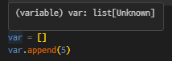
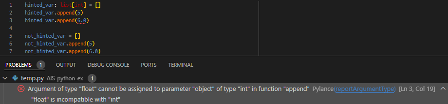

# Type hints (자료형 힌트) 정리

Python의 정적 분석 및 코드 분석 효율화를 위한 Typing 관련 정리 및 예시 문서

## Type hints 란?

Pyhton의 경우 `Duck Typing`이라는 개념으로 각 객체의 유형보다는 그 안에 있는 속성과 method로 결정됨.  
이러한 요소는 빠른 생산성을 가져오지만, 반대로 해당 객체의 속성과 method를 정확히 모를 경우, 코드 읽기가 어려울 수 있다.  
해당 문제점을 보완하기 위하여, 각 인자의 자료형을 표시할 수 있는 방법으로 `type hints`가 존재 함.  

`단, 해당 사항은 python애서 이를 필수적으로 사용해야 함을 의미하는 것은 아니며, 단지 보조적인 요소로 제시 됨.`

## Type hints 장점

- 통합개발환경(IDE)에서 해당 type hint를 바탕으로 정적 코드 분석을 진행할 수 있음

- 각 개체에 존재하는 속성과 method에 대하여 자동완성 기능을 사용 가능

## Type hints 사용 방법

### 암시적인 변수 type hints



일반적으로 코드 작성과 분석 과정에서 사용되는 통합개발환경(IDE, ex. visual studio code)에서는 해당 기능을 자동으로 활성화 되어 있음.  
위의 사진에서 별도의 작업을 하지 않았음에도`[암시적 사용]`, 변수 `var`가 `list`임을 보이고 있음.  
그 결과 변수 `var` 안에 존재하는 method `append`를 강조 표시를 해주고 있음을 확인 할 수 있음.  

### 명시적인 변수 type hints



암시적으로 사용된 `type hints`은 명시적인 사용한 경우와 비교하여 그 기능에 제한적인 요소가 많이 존재 함.  
위의 사진은 `list` 변수를 사용하여 명시적으로 사용한 경우와 그렇지 않은 경우에 대한 차이를 보이고 있음.  

그림에서 2개의 변수 `hinted_var`과 `not_hinted_vat`은 코드에서 동일한 데이터를 가진 서로 다른 list임.  
list를 초기화 하고, list에 5를 추가하는 과정까지는 int 자료형으로 구성된 list임.  
하지만 6.0을 추가하면서 list에 존재하는 데이터가 int만이 아닌 float의 가능성이 생김.  

이러한 실수를 줄이기 위하여, 명시적인 type hint를 사용하는 것이 적합함.  
변수 `hinted_var`와 같이 명시적으로 선언하는 것으로 해당 문제를 조기에 발견하고 대응하는 것이 가능함.  

### typing 모듈을 사용한 type hints 기초

```python
from typing import 

class Person():
    def __init__(self, naem, age):
        self.name = name
        self.age = age

```
