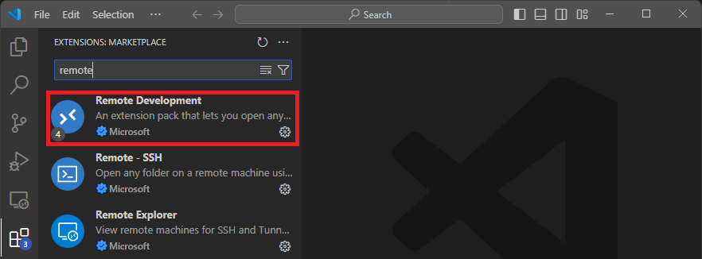
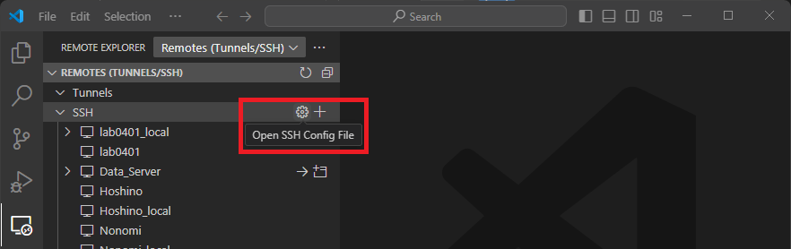
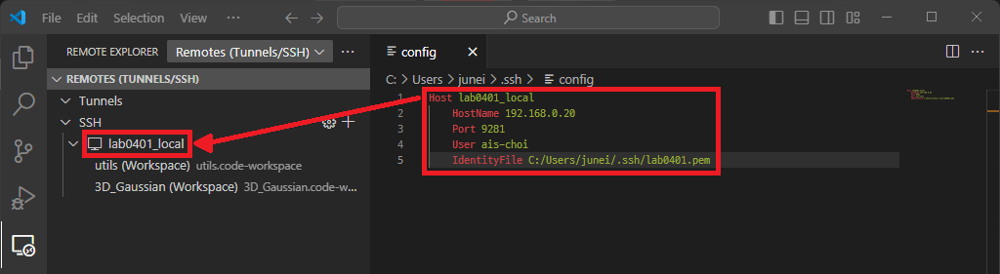
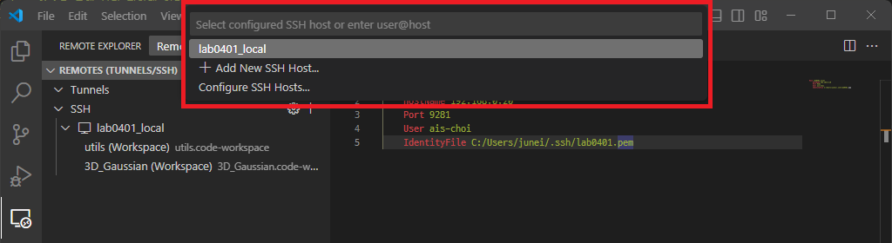
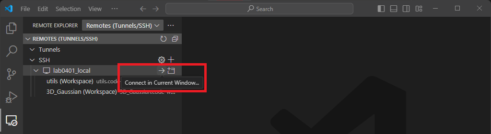

# SSH를 이용한 원격 개발환경 구성

Visaul Studio Code에서 MS에서 공식으로 제공하는 확장툴을 이용하여 일반적으로 익숙한 window 기반으로 연구가 가능하도록 구성하는 방법을 정리.  
일반적으로 widnow로 구성된 개인용 컴퓨터에서 연구에 사용되는 ubuntu 환경이 구축된 단말기에 접속하는 형태로 진행 됨.  
이때 보안 및 속도를 고려하여, ssh 기반 연결을 통해 해당 방식을 진행 함.

## 확장 프로그램 설치

### 1. 원격 연결을 위하여 Visaul Studio Code 확장 프로그램을 설치

- MS에서 공식적으로 제공하는 `Remote Devleopment`를 설치하는 경우 개발 환경 원격 연결을 위한 대부분의 기능 설치 가능
   

### 2. ssh config 파일 작성

- 연결할 때마다 서버 주소와 계정을 입력하는 것도 가능하나, ssh 연결 정보를 적은 별도의 파일(ssh config)을 통해 보다 편하게 연결 가능
- 기본적으로 설정된 경로의 경우 ssh config를 사용하는 대상 범위(전체, 해당 유저)를 제외한 나머지에서 차이는 없음.
   

- ssh config의 구성은 아래 내용과 같음 (`${변수명}`로 표시된 부분은 본인 설정에 맞는 적절한 값으로 수정)

   ``` yaml
   Host ${서버_구분_이름}
      HostName ${서버_주소}  # DDNS 이름 지원
      Port ${포트_번호}
      User ${접속_계정_이름}
      IdentityFile ${SSH_PUB_KEY_경로} # 선택
   ```

- 원격 연결 관리 탭에서는 ssh config 파일에 작성한 `${서버_구분_이름}`으로 출력됨

   

### 3. ssh 연결

- 명령창에 `>Remote-SSH: Connect to Host` 또는 `>Remote-SSH: Connect Current Window to Host`을 통해 서버와 연결 시도
- SSH 원격 연결할 서버의 정보(계정@서버주소:port 번호)를 입력하거나, SSH config에 등록된 설정을 선택
   
- 또는 원격 연결 관리 탭에서 연결하고자 하는 SSH config에 등록된 설정 이름 옆에 연결 버튼을 클릭
   
