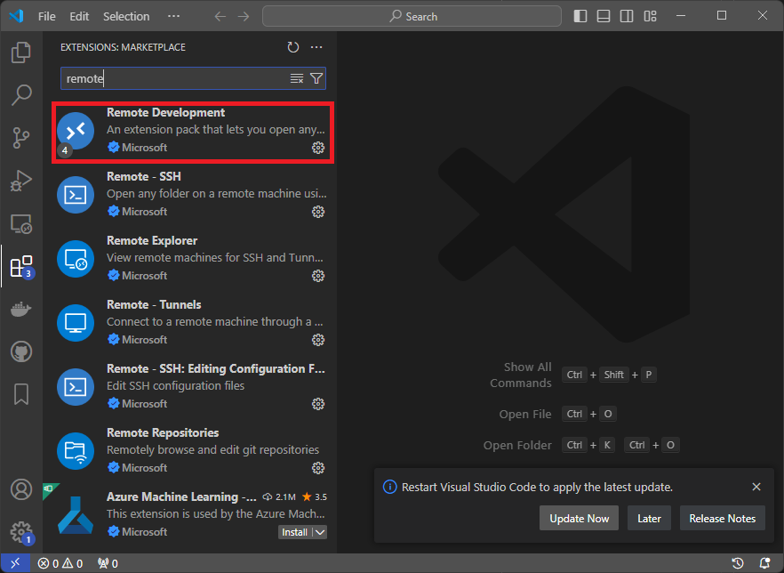
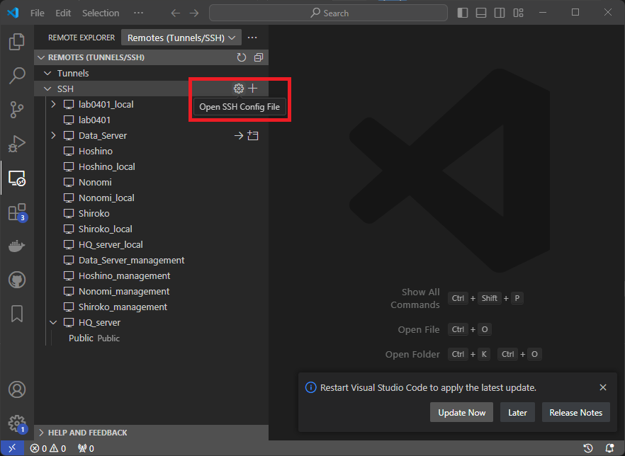
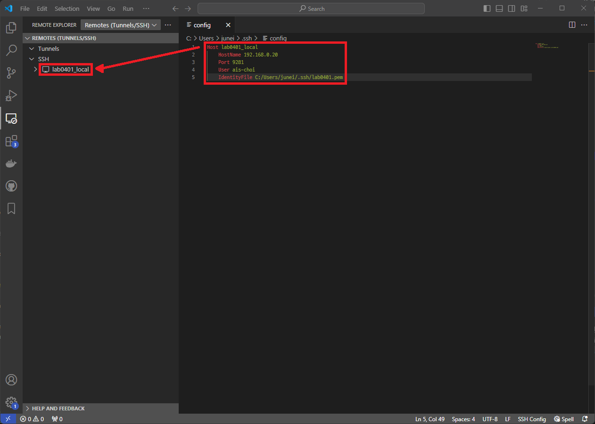

# SSH를 이용한 원격 개발환경 구성

Visaul Studio Code에서 MS에서 공식으로 제공하는 확장툴을 이용하여 일반적으로 익숙한 window 기반으로 연구가 가능하도록 구성하는 방법을 정리.  
일반적으로 widnow로 구성된 개인용 컴퓨터에서 연구에 사용되는 ubuntu 환경이 구축된 단말기에 접속하는 형태로 진행 됨.  
이때 보안 및 속도를 고려하여, ssh 기반 연결을 통해 해당 방식을 진행 함.

## 확장 프로그램 설치

1. 원격 연결을 위하여 Visaul Studio Code에서 사용가능한 확장 프로그램을 설치.  
    MS에서 공식적으로 제공하는 `Remote Devleopment`를 설치하는 경우 개발 환경 원격 연결을 위한 대부분의 기능 설치 가능  
    

2. 원격 연결 관리 탭(Remote Explorer)에서 SSH config 파일을 선택  
   window에서 해당 버튼 선택시 나오는 옵션은 ssh config를 사용하는 대상 범위(전체, 해당 유저)를 제외한 나머지에서 차이는 없음.  
    

   ssh config의 구성은 다음과 같음 (`${변수명}`로 표시된 부분은 본인 설정에 맞는 적절한 값으로 수정)

   ``` yaml
    Host ${서버_구분_이름}
        HostName ${서버_주소}  # DDNS 이름 지원
        Port ${포트_번호}
        User ${접속_계정_이름}
        IdentityFile ${SSH_PUB_KEY_경로} # 선택
   ```  

    
